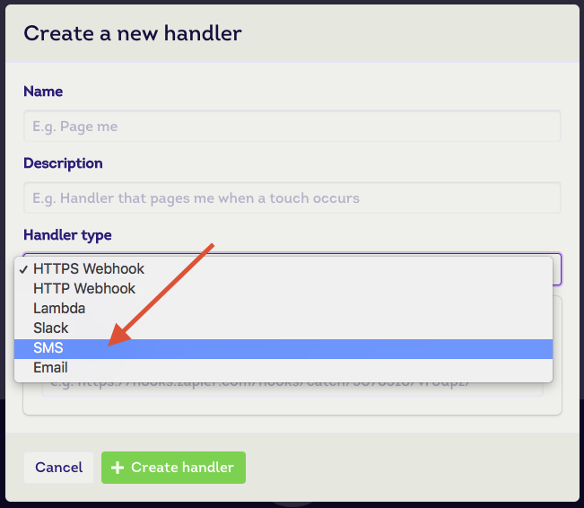
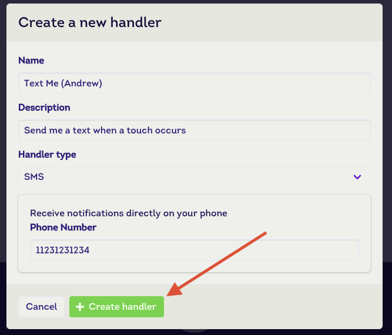

# Receive SMS Notifications

This document describes how to make use of the [SMS Touch Handler Type](/reference/touch-handler-types/sms) to receive text message notifications.

These touch handlers are typically found in situations such as:

* High priority [touchpoint](/reference/touchpoints) that requires immediate attention
* Smaller deployments by number of touchpoints or operations staff members
* No existing issue tracking system

## Guide

#### Step 1

First off, we want to make sure we're in our desired [workspace](/references/workspaces). Click on the menu bar dropdown to choose.

#### Step 2

Then we want to select the **Handlers** tab within the workspace view.

#### Step 3

From there, we'll want to click on the **+ New Handler** button. This will launch a modal for creating new touch handlers.

#### Step 4

Once we're in the touch handler creation model, we'll want to select **SMS** from the _Handler type_ dropdown list.

#### Step 5

Give your handler a _name_, _description_ (optional) and enter your phone number.

::: tip Heads up!
The phone number **must** start with your country calling code. If you're unsure, check [wikipedia](https://en.wikipedia.org/wiki/List_of_country_calling_codes) for the full list.
:::

#### Step 6

Click on **+ Create handler** to complete the process.

