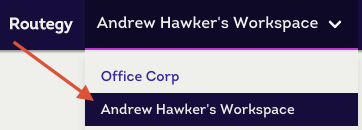
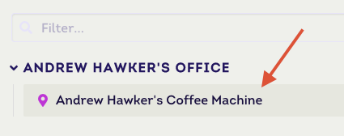
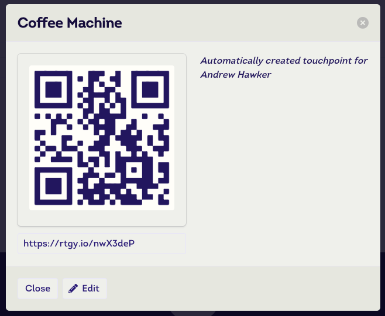
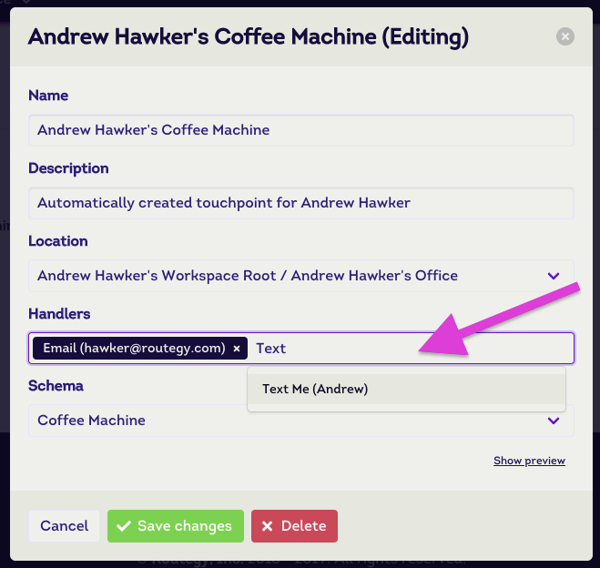
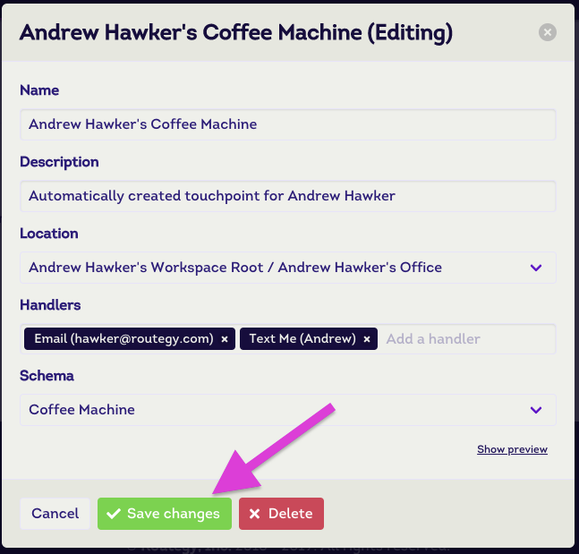

# Receive SMS Notifications

This document describes how to make use of the [SMS Touch Handler Type](/reference/touch-handler-types/sms) to receive text message notifications.

SMS touch handlers are commonly used with high priority [touchpoints](/reference/touchpoints) that requires immediate attention or staff members that are constantly on the go.

### Creating the Touch Handler

Follow the steps below to create a [touch handler](/references/touch-handlers) for sending SMS notifications.

#### Step 1

Start by making sure you're in the desired [workspace](/references/workspaces). Click on the menu bar dropdown to choose.

#### Step 2

Select the **Handlers** tab within the workspace view.

#### Step 3

Click on the **+ New Handler** button. This will launch a modal for creating new touch handlers.

#### Step 4

From the touch handler creation model, select **SMS** from the _Handler type_ dropdown list.

#### Step 5

Enter a _name_, _description_ (optional) and desired phone number.

::: warning Heads up!
The phone number **must** start with your country calling code. See [wikipedia](https://en.wikipedia.org/wiki/List_of_country_calling_codes) for details.
:::

#### Step 6

Click on **+ Create handler** to complete the process.

### Attaching Touch Handler to Touchpoint

Follow the steps below to attach the SMS touch handler created above to one or more [touchpoints](/reference/touchpoints).

#### Step 1

Select the **Touchpoints** tab within the workspace view.

#### Step 2

Select the [touchpoint](/reference/touchpoints) you wish to receive SMS notifications for.

#### Step 3

From the touchpoint model, click on the **Edit** button.

#### Step 4

From the touchpoint edit model, type in the name of your touch handler in _Handlers_ list. The name will autocomplete as you type.

#### Step 5

Click on the **Save changes** button and you're done!

